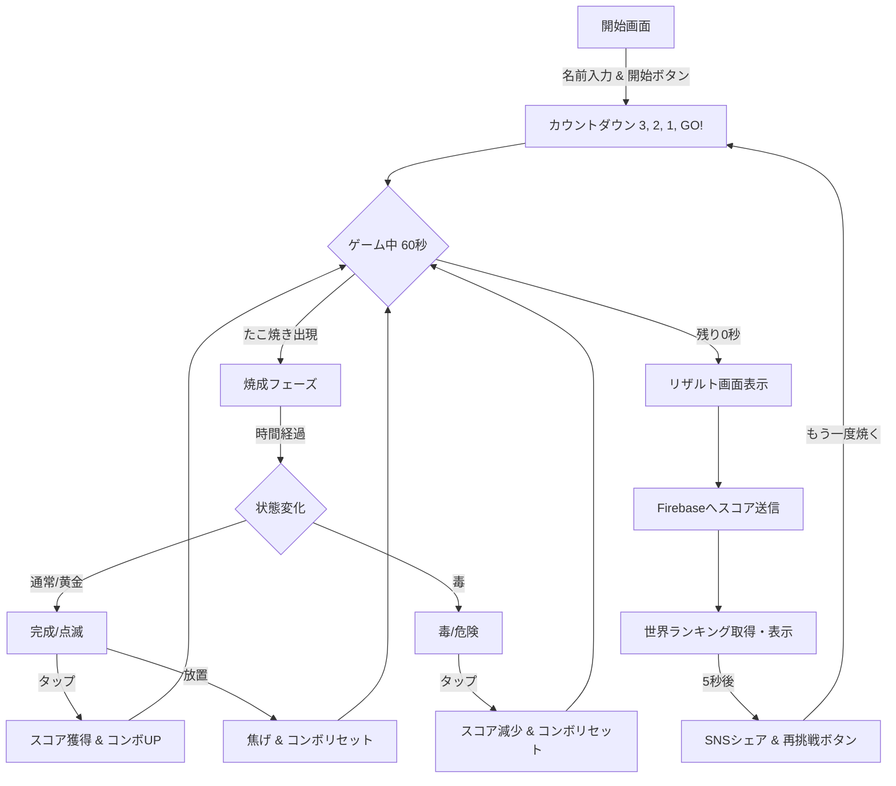

# 🐙 たこさし ～令和最新版～ ゲームルール説明

職人として、最高のたこ焼きを焼き上げろ！制限時間内にハイスコアを目指すゲームやで。

## 🔄 ゲームフロー

## 🎮 基本ルール
- **制限時間**: 60秒
- **操作**: 焼けたたこ焼きをタップして回収するだけ！

## 🍡 たこ焼きの状態と得点
たこ焼きは時間が経つにつれて状態が変わるで。タップするタイミングが命や！

| 状態 | 見た目 | 説明 | 得点 |
| :--- | :--- | :--- | :--- |
| **生・調理中** | 小さい | まだ焼けてへん。タップしても何も起きひんで。 | 0点 |
| **完成！** | 盛り付け済み | **最高の食べ頃！** すぐにタップして回収や！ | **20点** (通常) / **200点** (黄金) |
| **危険！** | 点滅中 | 焼けすぎや！得点が半分になってしまうで。 | **10点** (通常) / **100点** (黄金) |
| **焦げ** | 真っ黒 | 手遅れや。コンボも途切れてしまうから注意やで。 | 0点 (コンボリセット) |

### 特殊なたこ焼き
- **黄金のたこ焼き (10%)**: 出現率は低いけど、得点が通常の **10倍** や！
- **毒たこ焼き (15%)**: タップすると **-100点** かつコンボリセット！絶対触ったらあかんで。

## 🔥 コンボボーナス
連続でたこ焼きを回収するとコンボが積み上がるで。
- **5コンボごと** に、獲得スコアに **+50点** のボーナスが加算されるんや。
- 焦がしたり、毒を触ったりするとリセットされるから気をつけや！

## 🏆 ランク表
最終スコアに応じて、職人としてのランクが決まるわ。

- **35,000点～**: 🐙 たこ焼きの化身（もはやタコそのものや）
- **25,000点～**: 宇宙一の職人（人間卒業おめでとう）
- **15,000点～**: 令和のたこ焼き王（歴史に名を刻んだで）
- **8,000点～**: 行列の絶えない名店（プロの技やな）
- **3,000点～**: 近所の人気店（やるやんけ）
- **それ以下**: 門前払い（もっと修行してや）

## 🌐 オンライン機能
- **世界ランキング**: ハイスコアはFirebaseに保存され、TOP5が常に表示されるで。
- **SNSシェア**: 結果をX（旧Twitter）で自慢しよう！

---
**目指せ、宇宙一の職人！**
